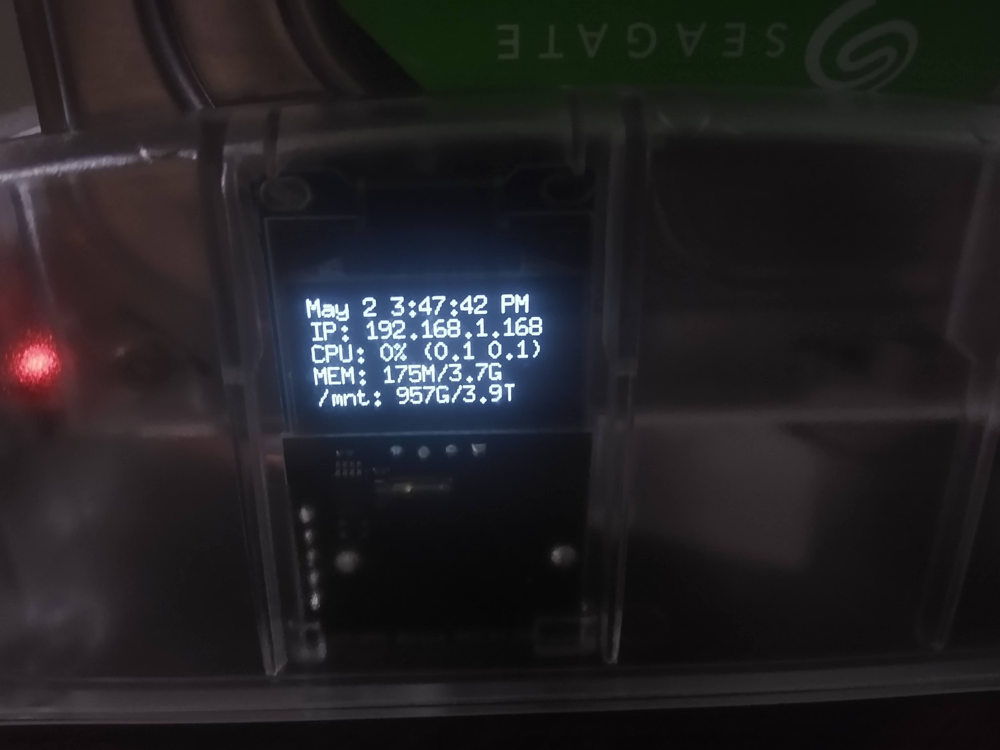
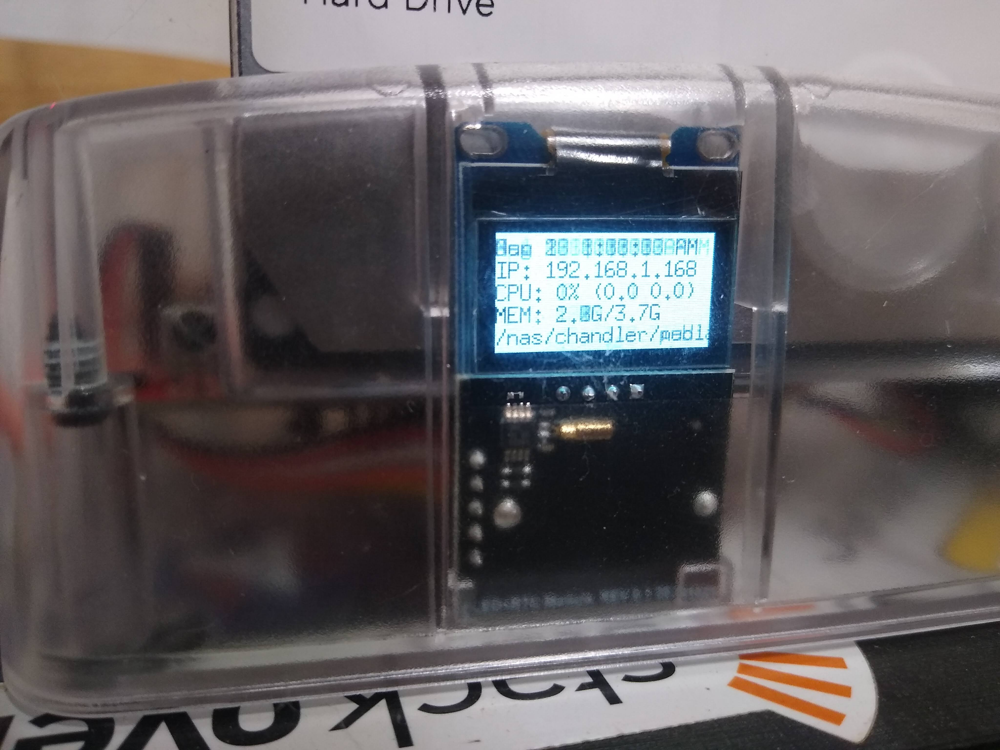

# odroidhc4-display

**Warning!** These displays do suffer from burn-in over time. I'm unable to find
a spec for the rated lifetime of these, but it was noticeable after a few months
of continuous use, and has grown pretty severe over a roughly 16 months of use.
See images below.

odroidhc4-display is a package to provide basic helpful output for the
[OLED display on the ODROID-HC4](https://wiki.odroid.com/odroid-hc4/application_note/oled).
It's intended to be a no-dependencies-required download-and-run alternative for
the `odroid-homecloud-display` (the base install requires pillow, which has some
native dependencies; the install of the examples requires pygame and all its
dependencies as well).

### Installing
```sh
# from source
git clone git@github.com:ChandlerSwift/odroidhc4-display.git
cd odroidhc4-display
go build # if not built elsewhere; you can also cross-compile with GOOS=linux GOARCH=arm64
sudo cp odroidhc4-display /usr/bin/
sudo cp odroidhc4-display.service /etc/systemd/system/
sudo systemctl daemon-reload
sudo systemctl enable --now odroidhc4-display

# or prebuilt
sudo curl -Lo /usr/bin/odroidhc4-display $(curl -s https://api.github.com/repos/ChandlerSwift/odroidhc4-display/releases/latest | jq -r ".assets[0].browser_download_url") 
sudo chmod +x /usr/bin/odroidhc4-display
sudo curl -Lo /etc/systemd/system/odroidhc4-display.service https://raw.githubusercontent.com/ChandlerSwift/odroidhc4-display/main/odroidhc4-display.service
sudo systemctl daemon-reload
sudo systemctl enable --now odroidhc4-display
```
### Sample output
Output includes:
 * Date and time
 * IP address, if any
 * CPU usage, 1 and 5 minute load averages
 * Memory usage
 * Disk usage of largest attached partition (this is assumed to be the disk pool)

```
May 2 3:47:42 PM
IP: 192.168.1.168
CPU: 0% (0.1 0.1)
MEM: 175M/3.7G
/mnt: 957G/3.9T
```



Displaying a fully white background after about 16 months of use:


<details>
<summary>Go code to display a fully-white screen</summary>

```go
package main

import (
	"image"
	"log"

	"periph.io/x/periph/conn/i2c/i2creg"
	"periph.io/x/periph/devices/ssd1306"
	"periph.io/x/periph/devices/ssd1306/image1bit"
	"periph.io/x/periph/host"
)

func main() {
	// Make sure periph is initialized.
	if _, err := host.Init(); err != nil {
		log.Fatal(err)
	}

	// Use i2creg I²C bus registry to find the first available I²C bus.
	b, err := i2creg.Open("")
	if err != nil {
		log.Fatal(err)
	}
	defer b.Close()

	dev, err := ssd1306.NewI2C(b, &ssd1306.Opts{
		W:             128,
		H:             64,
		Rotated:       true,
		Sequential:    false,
		SwapTopBottom: false,
	})
	if err != nil {
		log.Fatalf("failed to initialize ssd1306: %v", err)
	}

	img := &image.Uniform{image1bit.On}

	if err := dev.Draw(dev.Bounds(), img, image.Point{}); err != nil {
		log.Fatal(err)
	}

}
```

</details>
